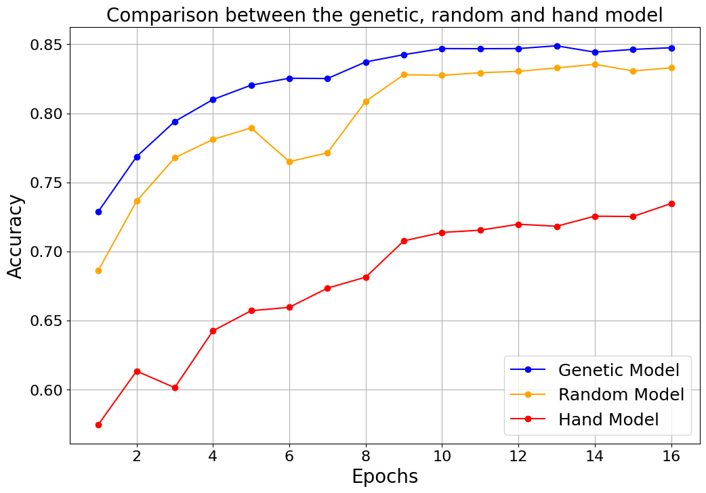
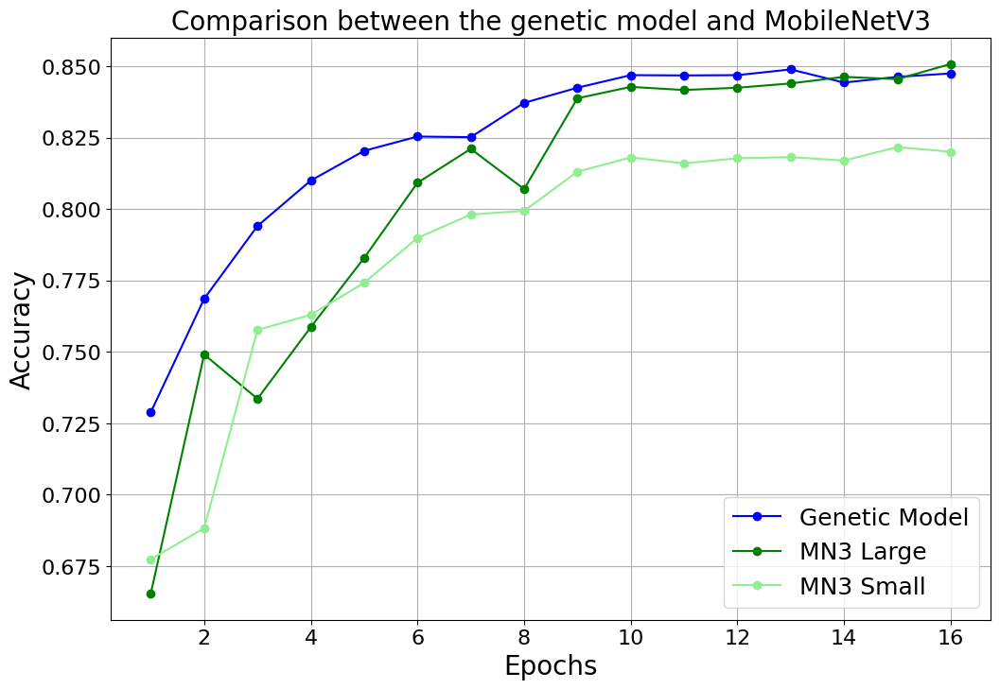

# Machine Learning and Deep Learning PoliTO a.a 2022/2023

**Project 4a: NAS for Tiny Visual Wake Words**

Project epository of the group made by:
- **Cassai Francesco :** s304626@studenti.polito.it
- **Giannì Giuseppe Enrico :** s302635@studenti.polito.it
- **Mullaaliu Roon :** s288450@studenti.polito.it

## Summary
The topic of tiny ML has risen through the recent years, thanks to the development of hardware and software ecosystems 
that supports it, such as micro-controllers that are commonly used in small devices.

In this paper we present a novel approach to address such subject, presented in the form of a classification problem
on the Visual Wake Words (VWW) dataset, using a block-based Neural Architecture Search (NAS).

Our focus is on devising an efficient and effective method for constructing optimal neural architectures that excel in
the classification task. The architectures evaluated are restricted by two constraints: one regarding the total number of parameters and one regarding the number of FLOPs. To achieve this task, we introduce a block-based NAS framework that integrates two distinct training-free metrics, NASWOT and Log-Synflow, in the architecture search process.

Our approach leverages a genetic algorithm with an evolution strategy, specifically employing a Tournament Selection 
with Ageing mechanism. This evolutionary algorithm facilitates the construction of diverse and high-performing architectures, which are compared to architectures generated through random search as well as manually designed ones. Furthermore we compare different choices of length of the architectures.

The results achieved in this paper are promising, showing an accuracy of the final architecture above the minimum 
threshold and which also outperforms the others constructed in a trivial way

_Figure 1: Comparison between the resulting models from the random search, from the genetic algorithm and the hand made model_

_Figure 2: Comparison between the best model of the genetic algorithm and the two versions of MobileNetV3_

## Running the Code
To run the code, you just need to open the `VWW.ipynb` file on google colab.
The notebook presents different sections:
- **Preparing the environment :** section used  to load packages and this repository
- **Compute mean and std per channel :** section used to compute eman and std in order to normalize when loading data
- **Load the data :** section used to create the Dataset and DataLoader objects
- **Model By Hands :** section used to train the hand model
- **Computing probabilities** section used to compute the per block acceptance probability when generating new random architectures
- **Random Search :** section used to find and train the best model from the random search
- **Genetic Algorithm :** section used to find and train the best model from the genetic algorithm
